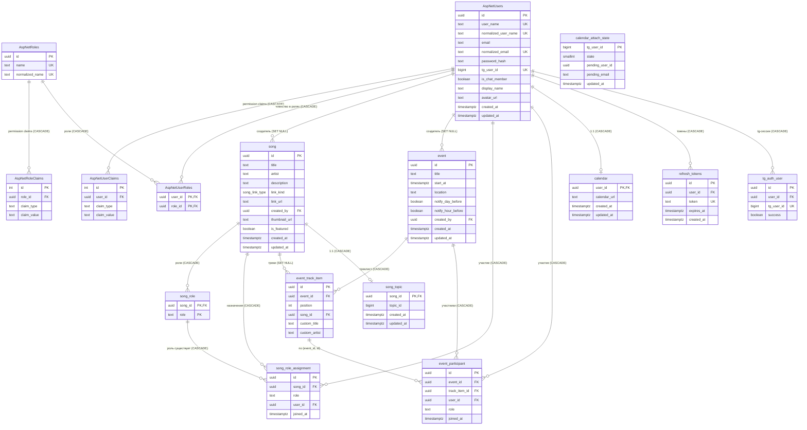

# ER-схема приложения Music Club

Схема описывает текущую структуру базы данных (PostgreSQL), формируемую EF Core 10 из флюент-конфигураций в `src/Infrastructure/Data/Configurations/`.

- Таблицы домена — в snake_case, единственное число (`song`, `song_role`).
- UUID-первичные ключи: `gen_random_uuid()`; метки времени — `NOW()`.
- `link_kind` — enum PostgreSQL `song_link_type` (`youtube` | `yandex_music` | `soundcloud`).
- **Единая модель пользователя — ASP.NET Identity.** `ApplicationUser` (`src/Domain/Entities/`, extends `IdentityUser`) маппится в `AspNetUsers` и расширен колонками `TgUserId`, `IsChatMember`, `DisplayName`, `AvatarUrl`, `CreatedAt`/`UpdatedAt`. Легаси-таблиц `app_user`/`user_permissions` нет.
- **Гранулярные права — `permission` claims** в `AspNetUserClaims`/`AspNetRoleClaims` (claim type `"permission"`, значения `participation.edit_own`, `participation.edit_any`, `songs.edit_own`, `songs.edit_any`, `songs.edit_featured`, `events.edit`, `tracklists.edit`).

## Mermaid-диаграмма

## Таблицы

### AspNetUsers (ApplicationUser)
Единая сущность пользователя приложения (ASP.NET Identity). Расширение `IdentityUser<Guid>` (Guid PK).

| Колонка | Тип | Примечание |
|---|---|---|
| `Id` | uuid PK | Guid-ключ |
| `UserName` / `NormalizedUserName` | text | уникальные |
| `Email` / `NormalizedEmail` | text | уникальный нормализованный |
| `PasswordHash` | text | legacy cookie-логин, UI не использует |
| `TgUserId` | bigint | уникальный (`idx_application_user_tg_user_id`), связь с Telegram |
| `IsChatMember` | boolean | default `false` |
| `DisplayName` | text | default `""` |
| `AvatarUrl` | text | |
| `CreatedAt` / `UpdatedAt` | timestamptz | default `NOW()` |

Остальные колонки Identity (`SecurityStamp`, `ConcurrencyStamp`, `PhoneNumber`, `LockoutEnd` и т.д.) — стандартные.

### AspNetUserClaims / AspNetRoleClaims
Гранулярные права в виде claims: `claim_type = 'permission'`, `claim_value` — одно из `participation.edit_own`, `participation.edit_any`, `songs.edit_own`, `songs.edit_any`, `songs.edit_featured`, `events.edit`, `tracklists.edit`. Claims на роли и на пользователя складываются при построении principal. Новым пользователям выдаются `songs.edit_own` + `participation.edit_own`; роль `Administrator` сидится со всеми `permission` claims.

### song
Песня. FK `created_by` → `AspNetUsers.Id` с `ON DELETE SET NULL`.

### song_role
Роль для песни. Составной PK `(song_id, role)`. FK → `song.id` с CASCADE.

### song_role_assignment
Назначение пользователя на роль песни. FK `(song_id, role)` → `song_role(song_id, role)` (`song_role_exists`, CASCADE) — назначение возможно только на существующую роль. Уникальность `(song_id, role, user_id)`.

### event
Событие. FK `created_by` → `AspNetUsers.Id` с `SET NULL`. Индекс `idx_event_start_at`.

### event_track_item
Пункт треклиста события. Ограничение `track_item_requires_title`: `song_id IS NOT NULL OR custom_title IS NOT NULL`. Уникальность `(event_id, position)`. Альтернативный ключ `(event_id, id)` (`track_item_identity`) — по нему ссылаются участники.

### event_participant
Участие пользователя в событии на роли (возможно, на конкретном треке). FK `(event_id, track_item_id)` → `event_track_item(event_id, id)` (`fk_event_participant_track_item`, CASCADE). Уникальность `(event_id, role, user_id, track_item_id)` (`uniq_event_participation`).

### tg_auth_user
Сессия подтверждения Telegram-авторизации (для потока `/start auth_<uuid>`). FK `user_id` → `AspNetUsers.Id` с CASCADE. `tg_user_id` уникален.

### refresh_tokens
Ротируемые refresh-токены. FK `user_id` → `AspNetUsers.Id` с CASCADE. `token` уникален.

### song_topic
Связь песни с топиком Telegram-канала (1:1). FK → `song.id` с CASCADE. `topic_id` не уникален (индекс `idx_song_topic_topic_id`).

### calendar
Ссылка на ICS-календарь пользователя (1:1). FK `user_id` → `AspNetUsers.Id` с CASCADE.

### calendar_attach_state
Состояние машины состояний бота при привязке календаря (short state 1/2/3). PK — `tg_user_id`. FK на пользователя нет (связь по `tg_user_id`).

## Сводка связей

| От | К | FK | On delete |
|---|---|---|---|
| AspNetUserClaims | AspNetUsers | `UserId` | CASCADE |
| AspNetUserRoles | AspNetUsers | `UserId` | CASCADE |
| AspNetUserRoles | AspNetRoles | `RoleId` | CASCADE |
| AspNetRoleClaims | AspNetRoles | `RoleId` | CASCADE |
| song | AspNetUsers | `created_by` | SET NULL |
| song_role | song | `song_id` | CASCADE |
| song_role_assignment | song | `song_id` | CASCADE |
| song_role_assignment | AspNetUsers | `user_id` | CASCADE |
| song_role_assignment | song_role | `(song_id, role)` | CASCADE |
| event | AspNetUsers | `created_by` | SET NULL |
| event_track_item | event | `event_id` | CASCADE |
| event_track_item | song | `song_id` | SET NULL |
| event_participant | event | `event_id` | CASCADE |
| event_participant | event_track_item | `(event_id, track_item_id)` | CASCADE |
| event_participant | AspNetUsers | `user_id` | CASCADE |
| song_topic | song | `song_id` | CASCADE |
| calendar | AspNetUsers | `user_id` | CASCADE |
| tg_auth_user | AspNetUsers | `user_id` | CASCADE |
| refresh_tokens | AspNetUsers | `user_id` | CASCADE |

## Примечания
- `calendar_attach_state` не имеет FK на пользователя (связь по `tg_user_id`).
- Enum `song_link_type` маппится в Npgsql через `MapEnum<SongLinkType>()`.
- Dev-база создаётся через `EnsureDeletedAsync` + `EnsureCreatedAsync` (миграции не применяются).
